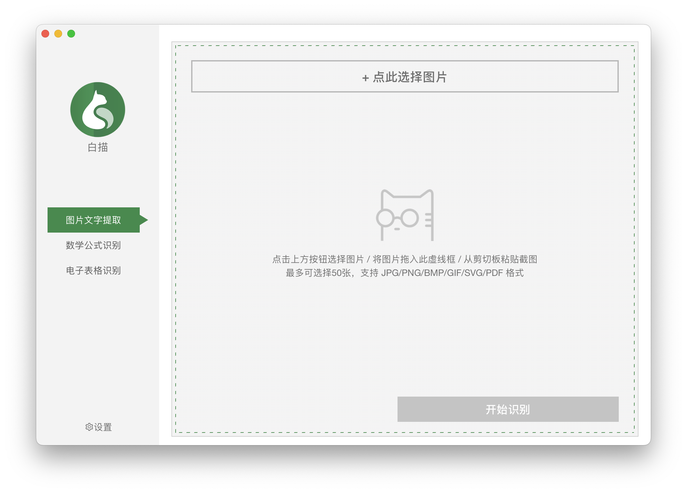
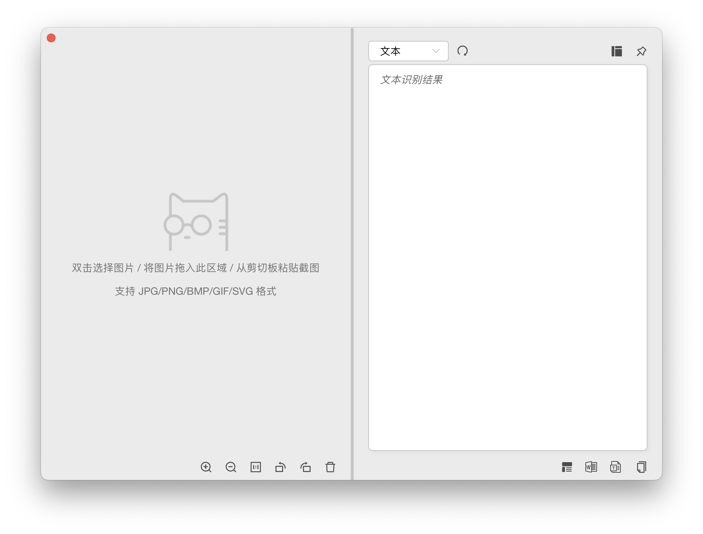
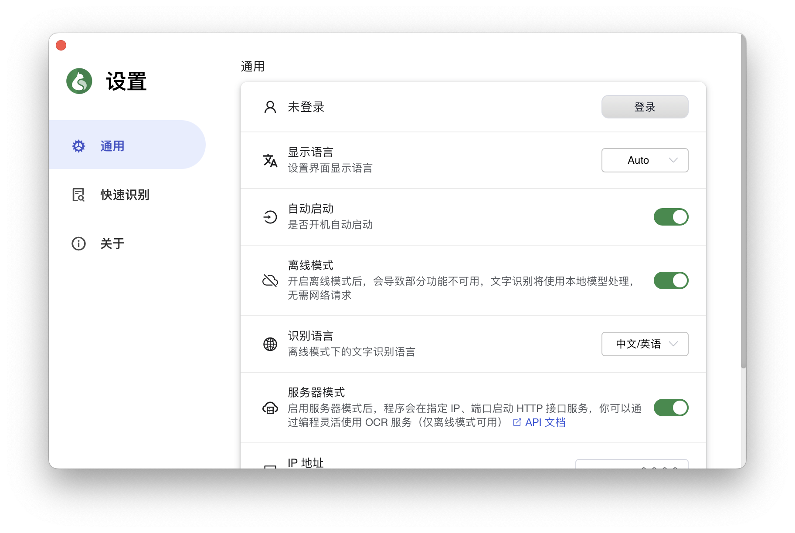
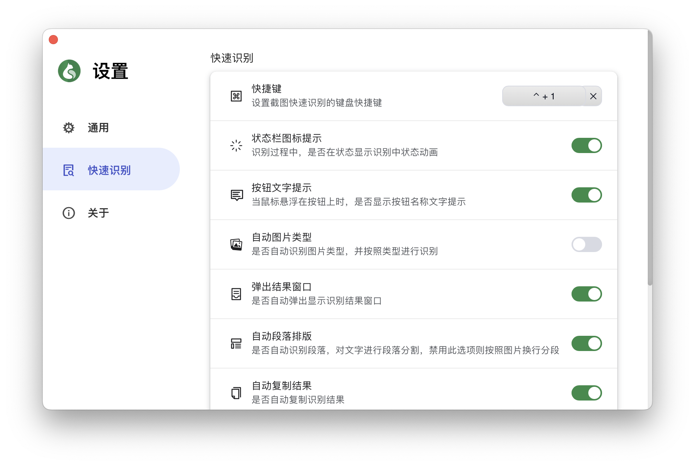
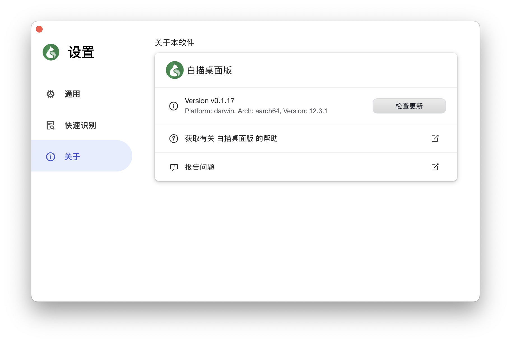

# 白描桌面版

白描桌面版是基于 [Tauri](https://github.com/tauri-apps/tauri) 实现的跨平台 OCR 软件，目前支持 Windows 7+1 和 macOS 10.13+，与 [白描 App](https://baimiaoapp.com/) 手机端、网页端会员账号通用。

\* _Windows 下截图功能依赖 [Microsoft .NET Framework 4](https://www.microsoft.com/zh-cn/download/details.aspx?id=17718)_  \
\* _Windows 下 Tauri 框架依赖 [Microsoft Edge WebView2](https://developer.microsoft.com/zh-cn/microsoft-edge/webview2/)_

## Features

- 快捷键截屏文字识别
- 自动复制结果到粘贴板
- 对识别结果智能段落排版
- 图片、PDF 文字识别
- LaTex 公式识别
- 图片转电子表格
- 二维码 / 条形码识别
- 浅色 / 深色模式
- 多语言支持（简/繁/英/日）
- 支持开机自启动
- 离线文字识别（macOS）
- 本地服务器模式提供 API 访问（macOS）

## Links

接口文档：[API.md](API.md)

版本发布：[RELEASES.md](RELEASES.md)

下载地址：[macOS](https://cdn.desktop.baimiaoapp.com/updater/download/latest/baimiao_universal.dmg) | [Windows](https://cdn.desktop.baimiaoapp.com/updater/download/latest/baimiao.msi)

## 截图

  
  
  
  
  

